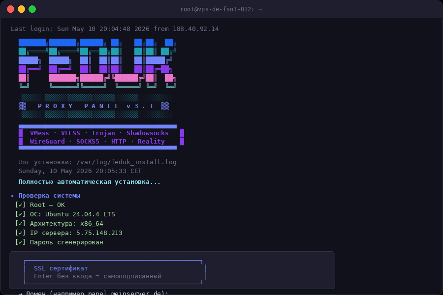
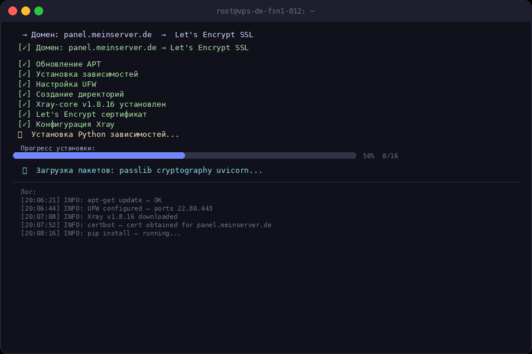
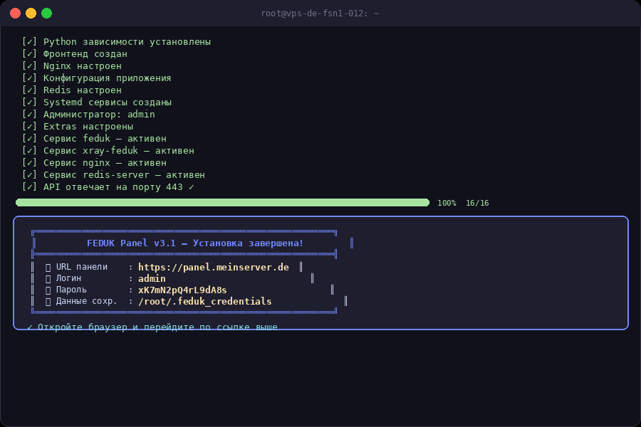

<div align="center">

<pre>
███████╗███████╗██████╗ ██╗   ██╗██╗  ██╗
██╔════╝██╔════╝██╔══██╗██║   ██║██║ ██╔╝
█████╗  █████╗  ██║  ██║██║   ██║█████╔╝
██╔══╝  ██╔══╝  ██║  ██║██║   ██║██╔═██╗
██║     ███████╗██████╔╝╚██████╔╝██║  ██╗
╚═╝     ╚══════╝╚═════╝  ╚═════╝ ╚═╝  ╚═╝
</pre>

# FEDUK Proxy Panel v3.1

**Полностью автоматическая установка прокси-сервера**  
VMess · VLESS · Trojan · Shadowsocks · WireGuard · Reality

[](https://ubuntu.com)
[](https://debian.org)
[](https://github.com/XTLS/Xray-core)
[](LICENSE)

</div>

---

## 🚀 Быстрая установка

```bash
bash <(curl -fsSL https://raw.githubusercontent.com/holodgolod745-max/vpn-panel8/main/install.sh)
```

> Запускать от `root`. Установка занимает ~3-5 минут.

---

## 📸 Скриншоты

### Запуск установщика — баннер и проверка системы



### Процесс установки — прогресс-бар, 16 шагов



### Установка завершена — логин, пароль, URL



### Вход в панель управления


### Дашборд — метрики сервера и сетевой график


### Управление клиентами и QR-коды


### Управление Inbounds


### Статус сервисов


---

## ⚙️ Что устанавливается

| Компонент | Версия | Описание |
|-----------|--------|----------|
| **Xray-core** | latest | Прокси-ядро (XTLS) |
| **FastAPI** | 0.111 | Backend API |
| **Nginx** | system | Reverse proxy + TLS |
| **Redis** | system | Кэш сессий |
| **SQLite** | — | База данных |
| **Certbot** | latest | Let's Encrypt SSL |

---

## 📁 Структура файлов после установки

```
/opt/feduk/
├── panel/
│   ├── main.py          # FastAPI backend
│   ├── static/          # Web UI
│   └── venv/            # Python virtualenv
├── xray/
│   ├── bin/xray         # Xray-core бинарник
│   └── configs/         # JSON конфиги
└── certs/
    ├── cert.pem         # SSL сертификат
    └── key.pem          # SSL ключ

/etc/feduk/config.yaml           # Настройки панели
/root/.feduk_credentials         # Логин / пароль / URL
/var/log/feduk_install.log       # Лог установки
```

---

## 🔌 API Endpoints

| Метод | Путь | Описание |
|-------|------|----------|
| `POST` | `/api/auth/token` | Получить JWT токен |
| `GET` | `/api/dashboard` | Метрики системы |
| `GET` | `/api/inbounds` | Список inbounds |
| `POST` | `/api/inbounds` | Создать inbound |
| `DELETE` | `/api/inbounds/{id}` | Удалить inbound |
| `GET` | `/api/clients` | Список клиентов |
| `POST` | `/api/clients` | Создать клиента |
| `GET` | `/api/status` | Статус сервисов |
| `POST` | `/api/xray/restart` | Перезапустить Xray |
| `GET` | `/api/docs` | Swagger UI |

---

## 🛡️ Безопасность

- HTTPS с Let's Encrypt или self-signed RSA-4096
- JWT авторизация с истечением токена
- UFW файрвол (открыты только 22, 80, 443)
- Пароль хэшируется через bcrypt (cost 12)

---

## 📋 Системные требования

- **ОС:** Ubuntu 20.04 / 22.04 / 24.04 или Debian 11 / 12
- **CPU:** 1 ядро (рекомендуется 2+)
- **RAM:** 512 MB минимум (рекомендуется 1 GB+)
- **Диск:** 2 GB свободного места
- **Сеть:** Публичный IP, открытые порты 80 и 443

---

## 🔧 Управление после установки

```bash
# Статус сервисов
systemctl status feduk xray-feduk nginx

# Перезапуск панели
systemctl restart feduk

# Перезапуск Xray
systemctl restart xray-feduk

# Логи панели
journalctl -u feduk -f

# Логи Xray
journalctl -u xray-feduk -f

# Данные для входа
cat /root/.feduk_credentials
```

---

<div align="center">

Made with ❤️ · [Сообщить об ошибке](../../issues) · [Документация API](/api/docs)

</div>
