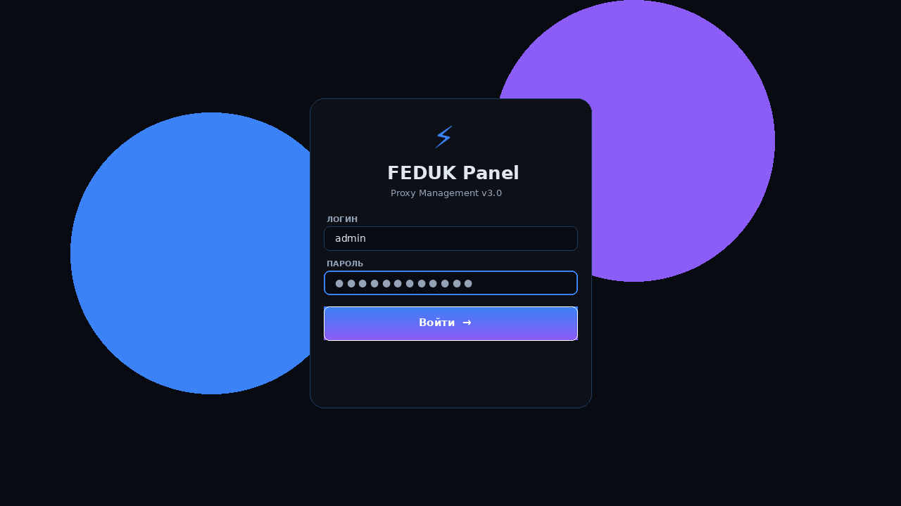
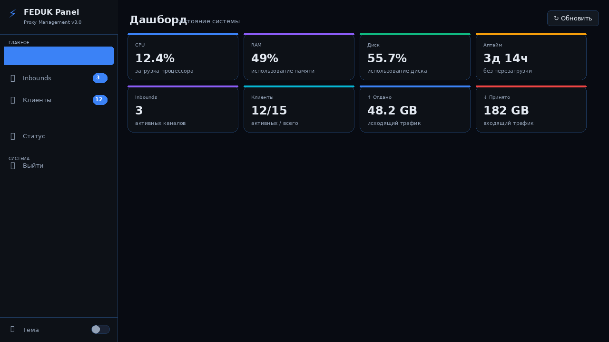
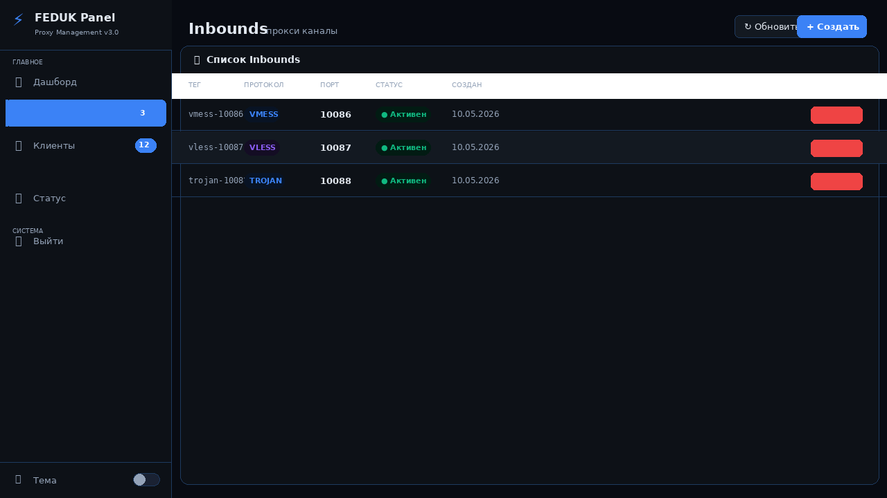
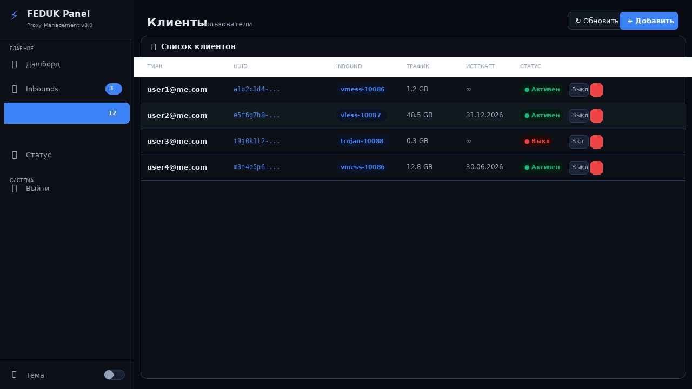
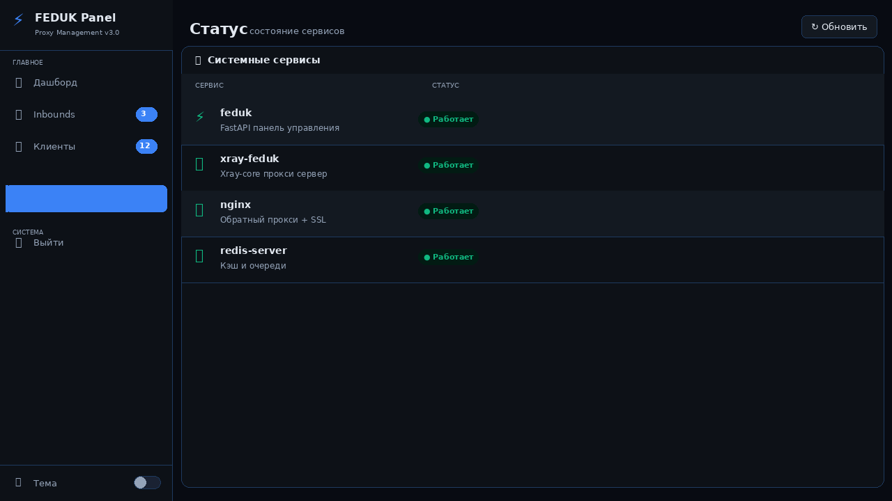

```markdown
<div align="center">

# ⚡ FEDUK Proxy Panel v3.1

**Современная панель управления прокси-серверами**

[](LICENSE)
[](https://python.org)
[](https://fastapi.tiangolo.com)
[](https://github.com/XTLS/Xray-core)
[](https://ubuntu.com)
[](https://debian.org)

</div>

---

## 🖼️ Скриншоты

| Вход в панель | Дашборд |
|:---:|:---:|
|  |  |

| Управление Inbounds | Управление клиентами |
|:---:|:---:|
|  |  |

| Статус сервисов |
|:---:|
|  |

---

## ✨ Возможности

- **Протоколы:** VMess · VLESS · Trojan · Shadowsocks · WireGuard · SOCKS5 · Reality
- **SSL:** Let's Encrypt (доверенный) или самоподписанный
- **Авторизация:** JWT-токены + bcrypt хеширование паролей
- **Мониторинг:** CPU, RAM, диск, трафик в реальном времени
- **Автоматизация:** ежедневный бэкап, автообновление сертификатов
- **Тёмная/светлая** тема
- **Утилиты:** feduk-status, feduk-backup, feduk-log

---

## 🚀 Быстрая установка

```bash
bash <(curl -fsSL https://raw.githubusercontent.com/holodgold745-max/vpnpanel8/main/install.sh)
```

Скрипт сам определит IP, спросит домен (опционально) и настроит всё автоматически.

Требуется root и Ubuntu 20.04-24.04 или Debian 11-12

---

📋 Требования к серверу

Ресурс Минимум Рекомендуется
CPU 1 ядро 2+ ядра
RAM 1 GB 2+ GB
Диск 10 GB 20+ GB

---

⚙️ Этапы установки

Шаг Действие
1 Проверка системы, определение IP
2 Установка зависимостей (Python, Node.js, Redis, Nginx)
3 Настройка файрвола UFW
4 Установка Xray-core (последняя версия)
5 SSL сертификат — Let's Encrypt (если указан домен) или самоподписанный
6 FastAPI бэкенд + SQLite БД
7 Веб-интерфейс (тёмная/светлая тема)
8 Systemd сервисы (автозапуск)
9 Создание администратора
10 Вывод URL, логина и пароля

---

🔒 Безопасность

· Пароли хешируются через bcrypt (12 раундов)
· JWT токены с TTL 24 часа
· TLS 1.2 / 1.3 только
· Заголовки HSTS, X-Frame-Options, X-Content-Type-Options
· Автообновление Let's Encrypt сертификатов через cron

---

📋 Команды управления

```bash
feduk-status          # Статус сервисов + данные доступа
feduk-backup          # Создать бэкап
feduk-log panel       # Логи панели
feduk-log xray        # Логи Xray
feduk-log all         # Все логи сразу

systemctl restart feduk       # Перезапуск панели
systemctl restart xray-feduk  # Перезапуск Xray
systemctl restart nginx       # Перезапуск Nginx
```

---

📁 Структура проекта

```
/opt/feduk/
├── panel/
│   ├── main.py          # FastAPI приложение
│   ├── static/          # Веб-интерфейс
│   └── venv/            # Python окружение
├── xray/
│   ├── bin/xray         # Xray-core
│   └── configs/         # Конфиги
├── certs/               # SSL сертификаты
├── data/config.db       # SQLite база
└── logs/                # Логи

/etc/feduk/config.yml    # Конфиг панели
/root/.feduk_credentials # Данные доступа (СОХРАНИТЕ!)
```

---

🐛 Решение проблем

Проблема Решение
Панель не открывается feduk-status && systemctl status feduk
Nginx не стартует nginx -t — проверить конфиг
Let's Encrypt не работает Проверить A-запись домена → IP сервера
Порт 80/443 занят lsof -i :80 -i :443 — найти и остановить
Xray не запускается journalctl -u xray-feduk -n 50

---

📄 Лицензия

MIT License — свобода использования и модификации.

---

<div align="center">

Сделано с ❤️ · Сообщить об ошибке · ⭐ Star на GitHub

</div>
```

